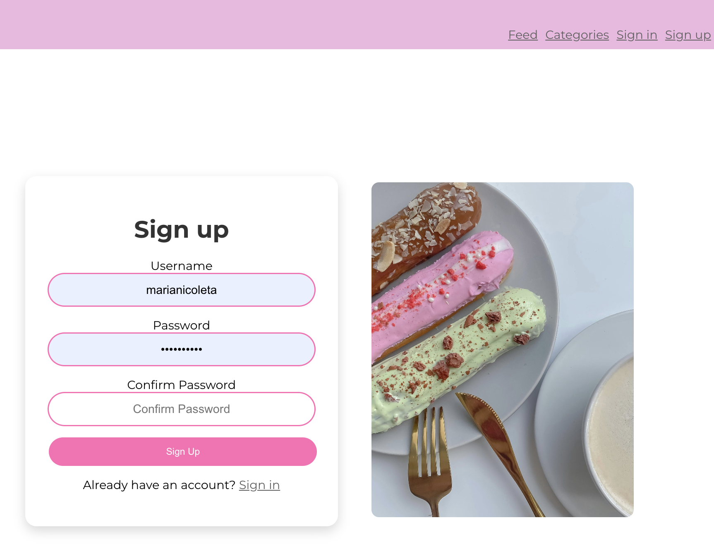
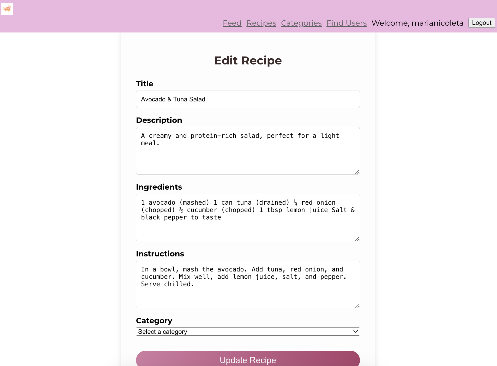
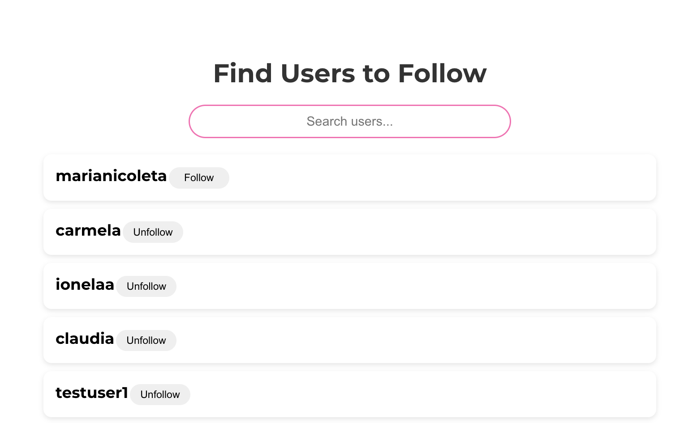
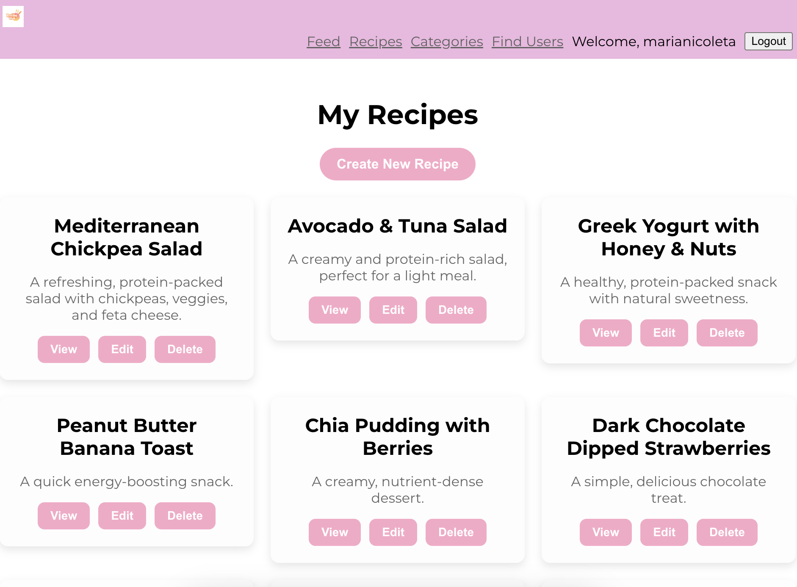
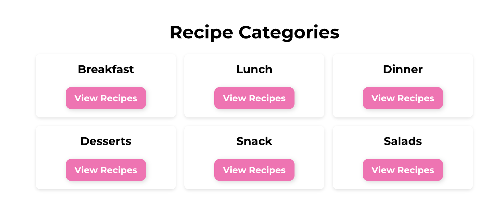
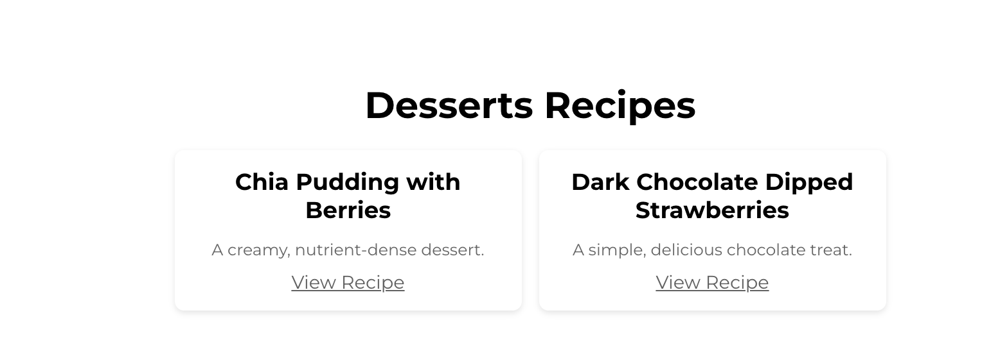

# Recipe Hub - Frontend

Recipe Hub (Frontend) is the client-side application that allows users to interact with the Recipe Hub platform. This React-based web app provides a seamless and responsive interface for browsing, creating, and managing recipes.

# Live Demo

[Click here to view the deployed frontend](https://recipe-hub-frontend-project-4896188af146.herokuapp.com/)

---

# Planning Overview

## **Project Goals**

- **User-Friendly UI**: Provide an intuitive and smooth user experience for browsing and managing recipes.
- **Seamless Navigation**: Implement clear and easy-to-use routing for different sections of the platform.
- **Responsive Design**: Ensure a fully functional mobile and desktop experience.

## **First-time User Experience**

- **Simple Sign-Up & Login**: Users can easily create an account or log in.

- **Clear Recipe Browsing**: Users can explore recipes with filtering options.
- **Easy Engagement**: Users can follow each other to keep up with everyone's recipes effortlessly.

---

# Features

### **User Authentication**

- Secure sign-up, log-in, and log-out functionality using JWT authentication.
- Password hashing and secure storage for user credentials.

### **Recipe Management**

- Create, update, and delete personal recipes.

- View a feed of recipes shared by followed users.
- Categorize recipes for better organization.

### **User Engagement**

- Follow functionality for better interaction.

- Browse recipies by category.

### **Search & Filtering**

- Category search for specific recipes.
- Filter recipes by category.

### **Responsive Design**

- Fully optimized for both mobile and desktop.

---

# **Frontend Screens & UI**

## **Home Page**

- Displays a feed of the latest recipes posts.

## **Recipes**

- Shows collection of personal private recipes.

## **Recipe Detail Page**

- Shows complete details of a recipe, including ingredients and preparation steps.

## **Sign-Up & Login Pages**

- Secure authentication pages for user access.

## **Categories Page**

- Browse recipes based on different categories.

## **Categories Page**

- Category detail to ensure is more specific.

---

# **Technologies Used**

- **React.js** - Main frontend framework.
- **React-Bootstrap** - UI styling.
- **Axios** - API requests.
- **React Router** - Client-side routing.

---

# **Frontend Deployment**

1.**PostgreSQL from Code Institute**
- Input your email address to receive a new Postgres database URL
- Create a database and check email to copy the link you received.

2. **Heroku App Setup**

  - Register & Log In with heroku
  - Navigate to `New > Create New App`
  - Select Name of the app that is unique
  - Select your region, and click "Create App.
  - Navigate to `Settings > Reveal Config Vars`
  - Add all variables from `env.py` to ConfigVars of Heroku App (your PostgreSQL database URL & Secret Key)
  - Add the Heroku app URL into `ALLOWED HOSTS` in `settings.py`
  - In root create file name `Procfile`
  - Navigate to `Deploy > GitHub > Connect`
  - Navigate to `Deploy > Deploy Branch`
  - Optionally, you can enable automatic deploys
  - See the deployment log - if the deployment was successful, you will be prompted with option to see live page 

### the env.py file
With the database created, certain variables need to be kept private and should not be published to GitHub.

In order to keep these variables hidden, it is important to create an env.py file and add it to .gitignore.
At the top import os and set the DATABASE_URL variable using the os.environ method. Add the URL copied from instance created above to it, like so: `os.environ[“DATABASE_URL”] = ”copiedURL”`
The Django application requires a SECRET_KEY to encrypt session cookies. Set this variable to any string you like or generate a secret key on this MiniWebTool. `os.environ[“SECRET_KEY”] = ”longSecretString”`

---

# **Forking & Cloning Instructions**

### **Forking the Repository**

Steps:
- Locate the GitHub repository.
- Click on 'Fork', in the top right-hand corner.
This will take you to your own repository to a fork with the same name as the original branch.

### **Cloning the Repository**

Steps:
- Go to the GitHub repository.
Click on 'Code' to the right of the screen. This will open a dropdown. Click on HTTPs and copy the link.
- Open Git Bash in your IDE and change the current working directory to the location where you want the cloned directory.
- Type git clone, paste the URL you copied earlier, and press Enter to create your local clone.

---

# **Credits**

- UI inspired by best practices in modern React development.
- Bootstrap framework used for styling.
- Various tutorials and references used for implementation.

**Live Project:** [Click here](#) *(Update with actual link once deployed)*